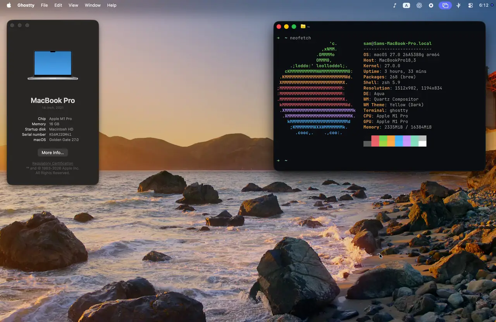

<h1 align="center">SpotifyWallpaper</h1>

<p align="center">
  Turn your Mac desktop into an ambient now-playing display.<br>
  Your music, artwork, and colors—across every Space.
</p>

<p align="center">
  <a href="#-features">Features</a>
  ·
  <a href="#-install">Install</a>
  ·
  <a href="https://github.com/finchett/Spotify-Wallpaper-Overlay/releases/latest">Latest release</a>
</p>

<p align="center">
  <a href="https://github.com/finchett/Spotify-Wallpaper-Overlay/releases/latest">
    
  </a>
  
  
  <a href="LICENSE">
    
  </a>
</p>

<p align="center">
  
</p>

## ✨ Features

- **Spotify Canvas or album artwork** — play a track's looping Canvas when one
  is available, or use an animated album-cover fallback with a slow Ken Burns
  effect.
- **Adaptive backgrounds** — build a gradient from the cover, keep your current
  wallpaper, or choose a separate image. Tune color intensity, blur, and
  brightness.
- **Every Space, no interaction cost** — the click-through overlay stays at the
  desktop level across macOS Spaces.
- **Custom song info** — show the title and artist briefly, permanently, or
  never; choose the corner, center position, and text size; or reveal it by
  clicking the desktop.
- **Playback-aware behavior** — animate the artwork away when Spotify stops and
  independently control the black menu-bar strip and rounded-corner masks.
- **Smooth Spaces and Mission Control** — optionally keep the current
  composition visible while switching desktops.
- **Native Mac conveniences** — launch at login, with optional menu-bar and Dock
  icons.

> [!TIP]
> No Canvas for a track? SpotifyWallpaper automatically switches to its
> animated album-cover treatment.

## 🚀 Install

> [!NOTE]
> Requires macOS 13 or later and the Spotify desktop app.

```bash
curl -fsSL https://raw.githubusercontent.com/finchett/Spotify-Wallpaper-Overlay/main/install.sh | bash
open -a SpotifyWallpaper
```

Run the same install command again whenever you want to update.

## 🎛️ Getting started

1. **Open SpotifyWallpaper** and allow the Automation requests for **System Events**
   and **Spotify**.
2. **Play something** in Spotify.
3. **Make it yours** from the menu-bar settings: customize the
   artwork, background, song info, playback behavior, and launch-at-login.

That's it—SpotifyWallpaper runs quietly in the background and follows the local
Spotify app. No Spotify developer project or API key is required.

---

<p align="center">
  <sub>Made for macOS · <a href="LICENSE">MIT licensed</a></sub>
</p>
